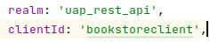

# SIO - Project 2 - Authentication

-----

## Group members

| NMec | Name | email |
|--:|---|---|
| 97147 | Jodionísio Muachifi  | jodionsiomuachifi@ua.pt |
| 97737 | António Bento | a.f.bento@ua.pt |
| 97979 | Francisco Gamelas | fgamelas11@ua.pt |
| 92441 | Ivan Xavier | ivanxavier@ua.pt |


## Folder organization

- **app_auth** -- contains the Web application with the extended authentication protocol, including instructions to run it. This represents the web page, running in a remote server.
- **uap** -- contains the UAP, including instructions to run it. This component would run in the client computer.
- **README.md** -- contains the project description and the authors.


## Instructions to run the project
To run the project, follow this instructions:
- **1º:** Run [UAP](https://github.com/detiuaveiro/project-2---authentication-equipa_2/tree/master/uap)
- **2º:** Run [APP_AUTH](https://github.com/detiuaveiro/project-2---authentication-equipa_2/tree/master/app_auth)

## Deploy Diagram


# BCrypt


Password encoders allow you to compare information stored in two separate sites, without being sent. For this, we use cryptographic hashing algorithms to generate a hash (summary) of the data. Salt allows you to generate different results for the same information. This process can be repeated several times (rounds) on each result, consuming a lot of resources, but increasing security from dictionary attacks drastically.


It is a cryptographic hash method, which maps variable-length data to fixed-length data with scattering algorithms.

| Authentication  |  Authorization  |
| --- | --- |
|  Algorithm  |  We generate a string where we pass the algorithm used to generate the hash.  |
|  Cost (Rounds)  |  The rounds represent the cost, for example: If it is equal to 10, we have 2^10=1,024 iterations.  |
|  Salt  |  increases entropy, makes identical passwords produce different results.  |
|  Password Hash  |  Finally we have the password hash.  |

---


# Authentication and Authorization


|  Authentication  |  Authorization  |
|  Identifies users and gives access to the system  |  Authority of each user to access resources  |
|  Authentication is done before authorization  |  Authorization is done after authentication  |
|  Need User Credentials  |  Need the privileges and roles  |
|  Identify the user in each action  |  Decide what actions the user can take  |


OpenID Connect is a protocol on top of the OAuth 2.0 framework that allows you to verify the identity of clients based on an authorization server, obtaining client and session information through an ID Token.
The intention is to create a standard to share the identity of clients between applications with encrypted information.
OpenID sets scopes for openid, profile, email and address and exposes a new endpoint “/userinfo”
The authentication provided by OpenID together with the authorizations of OAuth2.0 allow you to create an IAM(Identity and Access Management) system.
Structure and processes of administration and management of resources, responsible for the rights, privileges and groups of members.
With the increase of applications communicating with each other, this solution makes it easy to share data in a standard format.

---


# CORS and CSRF


##Cross-Origin Resource Sharing (CORS)
It consists of blocking scripts by definition, which try to communicate with other domains.

##Cross-Site Request Forgery (CSRF)
It consists of blocking requests that are destined for other domains.

In an attack on an unprotected server, another user's session can be used to manipulate the communication, make a request for a password change and a form with auto-submit, destined for example to Facebook, in order to change the access credentials.
It defends against malicious links that the attacker might create, such as a Facebook clone with a fake URL, as it checks if the redirect is valid.
To access protected resources, the client must send a Token attached to each request, which is associated with the client's identity and will be validated by the authentication server. This process allows protection from CORS and CSRF attacks.
---
# JWToken


 
This Token is normally generated during login, in the header it contains the algorithm and type, in the payload the information to be transmitted and in the end the signature, separations are made using the period (“.”) and it is encoded in BASE64.

##Benefits:
⋅⋅*It implements JSON format, easy to use and is used in web requests.
⋅⋅*As we don't use cookies, we don't need protection against CSRF attacks.
⋅⋅*Allows you to maintain the Authorization/Authentication with all the information transferred in the payload.
⋅⋅*It is a popular and well-documented implementation.

 
---
<span style="color: darkcyan">#Signature:</span>

We signed the package with the HMAC in SHA256 of the package, where we send the header plus the payload with the secret:
```
HMACSHA256(base64UrlEncode(header) + “.” + base64UrlEncode(payload), secret)
```
Helps to maintain data integrity, when integrated with the private key, allows verifying the identity of the sender.
---

# Roles

The authorizations of each user are isolated through “Roles”, it allows to check if a user can invoke a certain method, in the context of our application we use the roles “USER” and “ADMIN” to differentiate these permissions.

| Endpoint |  Authorization  |
| --- | --- |
|  /myAccount  |  Protected, needs "USER" and "ADMIN"  |
|  /myBooks  |  Protected  |
|  /contact  |  Unprotected  |


## Web Application Implementation

To approach the project itself and taking into account that a web application was needed to run the front-end, the development team decided to elaborate a new application with the authentication as priority, this application was developed using Angular framework, supporting Keycloak endpoints in order to connect to the Keycloak server and the resource server.

First, the keycloak service is initialized using ```keycloak.init()```, like so:


Using angular routing properties, when the login buttons are selected, there is a Login function that gets triggered, this function triggers the login function present in the keycloak object, like so:
```
  public login() {
    this.keycloak.login();
  }
```

This takes the user to the Keycloak server page for authentication, this key step was placed like so configuring the keycloak server with the web application, placing the same realm and client on both of them, without this, the authentication wouldn't work as expected.




After the correct insertion of credentials, the user is now redirected back to the web application, with his roles, while back in the app, the user variable is filled with the user data, including also the ```AUTH``` tag that is going to be used for later elements to be shown, this function being ```isAccessAllowed()```.

This itself works as barrier to protect the users credentials, since these are not introduced in the web application directly.

When the user is authenticated and redirected back to the app, the layout presented to him changes, presenting him with the user pages that he can now access, this was implemented using angular if conditions, verifying if the user is authenticated, like so:


