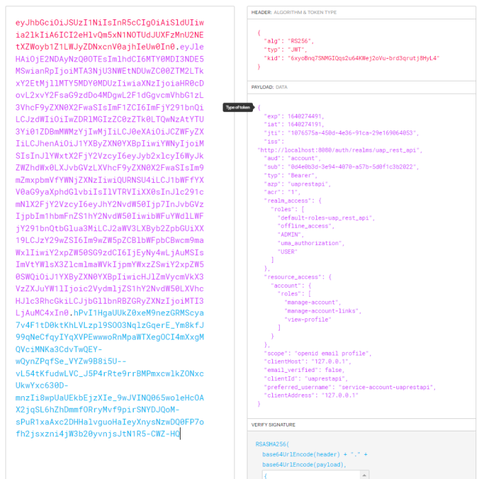

# SIO - Project 2 - Authentication

<br />

## Group members

| NMec | Name | email |
|--:|---|---|
| 97147 | Jodionísio Muachifi  | jodionsiomuachifi@ua.pt |
| 97737 | António Bento | a.f.bento@ua.pt |
| 97979 | Francisco Gamelas | fgamelas11@ua.pt |
| 92441 | Ivan Xavier | ivanxavier@ua.pt |

<br />

---

## Folder organization

- **app_auth** -- contains the Web application with the extended authentication protocol, including instructions to run it. This represents the web page, running in a remote server.
- **uap** -- contains the UAP, including instructions to run it. This component would run in the client computer.
- **README.md** -- contains the project description and the authors.
<br />

---

## Instructions to run the project
To run the project, follow this instructions:
- **1º:** Run [UAP](https://github.com/ivanxavier7/python/tree/main/backup/uap)
- **2º:** Run [APP_AUTH](https://github.com/ivanxavier7/python/tree/main/backup/app_auth)
<br />

---

## Introduction
This project was designed in order to represent a secure authentication method. Our group decided to handle and implement an authentication server to control the access to the resources.<br />
<br />
This authentication server will be the midpoint between the client app and the resource servers, which can support different types of client apps in a scalable way, since the strategy that we defined to implement the points mentioned above is to centralize authentication and resources for client administration.<br />
<br />
The intention is to manage several applications and databases, allows you to delegate and revoke permissions from different clients or applications, with a single authentication / authorization server.<br />
<br />

<br />
<br />

---

# BCrypt

Password encoders allow you to compare information stored in two separate sites, without being sent. For this, we use cryptographic hashing algorithms to generate a hash (summary) of the data. <br />
Salt allows you to generate different results for the same information. <br />
This process can be repeated several times (rounds) on each result, consuming a lot of resources, but increasing security from dictionary attacks drastically.<br />

<br />

<br />
It is a cryptographic hash method, which maps variable-length data to fixed-length data with scattering algorithms.<br />
<br />

<br />

<br />

| Structure  |  Description |
| --- | --- |
|  Algorithm  |  We generate a string where we pass the algorithm used to generate the hash.  |
|  Cost (Rounds)  |  The rounds represent the cost, for example: If it is equal to 10, we have 2^10=1,024 iterations.  |
|  Salt  |  Increases entropy, makes identical passwords produce different results.  |
|  Password Hash  |  Finally we have the password hash.  |

<br />


During project development we used [Bcrypt-generator](https://bcrypt-generator.com/) to decrypt the password hash<br />

<br />

---


# Authentication and Authorization


- OpenID Connect is a protocol on top of the [OAuth 2.0](https://oauth.net/2/) framework that allows you to verify the identity of clients based on an authorization server, obtaining client and session information through an ID Token.

- The intention is to create a standard to share the identity of clients between applications with encrypted information.

- OpenID sets scopes for openid, profile, email and address and exposes a new endpoint “/userinfo”.

- The authentication provided by OpenID together with the authorizations of OAuth2.0 allow you to create an IAM(Identity and Access Management) system.

- Structure and processes of administration and management of resources, responsible for the rights, privileges and groups of members.

- With the increase of applications communicating with each other, this solution makes it easy to share data in a standard format.

 <br />

| Authentication  |  Authorization  |
| --- | --- |
|  Identifies users and gives access to the system  |  Authority of each user to access resources  |
|  Authentication is done before authorization  |  Authorization is done after authentication  |
|  Need User Credentials  |  Need the privileges and roles  |
|  Identify the user in each action  |  Decide what actions the user can take  |

<br />

---

# CORS and CSRF


## Cross-Origin Resource Sharing (CORS)
It consists of blocking scripts by definition, which try to communicate with other domains.<br />
<br />

## Cross-Site Request Forgery (CSRF)
It consists of blocking requests that are destined for other domains.<br />
<br />

### Associated Attack Example
In an attack on an unprotected server, another user's session can be used to manipulate the communication, make a request for a password change and a form with auto-submit, destined for example to Facebook, in order to change the access credentials.<br />
It defends against malicious links that the attacker might create, such as a Facebook clone with a fake URL, as it checks if the redirect is valid.<br />
To access protected resources, the client must send a Token attached to each request, which is associated with the client's identity and will be validated by the authentication server. This process allows protection from CORS and CSRF attacks.

<br />

---

# JWToken

<br />

<br />

This Token is normally generated during login, in the header it contains the algorithm and type, in the payload the information to be transmitted and in the end the signature, separations are made using the period (“.”) and it is encoded in BASE64.<br />

<br />

## Benefits:
- It implements JSON format, easy to use and is used in web requests.
- As we don't use cookies, we don't need protection against CSRF attacks.
- Allows you to maintain the Authorization/Authentication with all the information transferred in the payload.
- It is a popular and well-documented implementation.
 
 <br />

---

# Signature:


We signed the package with the HMAC in SHA256 of the package, where we send the header plus the payload with the secret:

```
HMACSHA256(base64UrlEncode(header) + “.” + base64UrlEncode(payload), secret)
```
 <br />

Helps to maintain data integrity, when integrated with the private key, allows verifying the identity of the sender.<br />

During project development we used [JWT-IO](https://jwt.io/) to decrypt the password hash<br />
 
<br />
 <br />

---

# Roles


The authorizations of each user are isolated through “Roles”, it allows to check if a user can invoke a certain method, in the context of our application we use the roles “USER” and “ADMIN” to differentiate these permissions.<br />

| Endpoint |  Authorization  |
| --- | --- |
|  /myAccount  |  Protected, needs "USER" and "ADMIN"  |
|  /myBooks  |  Protected  |
|  /contact  |  Unprotected  |

 <br />

---

## Client Application

For the purpose of the project, a web application was developed that supports authentication features, these were implemented thanks to keycloak that allows the redirecting to a component that allows the user to be authenticated, making this an authenticated and lawful user of the application, giving him permissions to place orders in the application itself.

<br />

To approach the project itself and taking into account that a web application was needed to run the front-end, the development team decided to elaborate a new application with the authentication as priority, this application was developed using Angular framework, supporting Keycloak endpoints in order to connect to the Keycloak server and the resource server.<br />
 <br />

First, the keycloak service is initialized using ```keycloak.init()```, like so:

<br />

 <br />

Using angular routing properties, when the login buttons are selected, there is a Login function that gets triggered, this function triggers the login function present in the keycloak object, like so:<br />

```
  public login() {
    this.keycloak.login();
  }
```

 <br />

This takes the user to the Keycloak server page for authentication, this key step was placed like so configuring the keycloak server with the web application, placing the same realm and client on both of them, without this, the authentication wouldn't work as expected.<br />
 <br />


 <br />

After the correct insertion of credentials, the user is now redirected back to the web application, with his roles, while back in the app, the user variable is filled with the user data, including also the ```AUTH``` tag that is going to be used for later elements to be shown, this function being ```isAccessAllowed()```.<br />

<br />

This itself works as barrier to protect the users credentials, since these are not introduced in the web application directly.<br />

When the user is authenticated and redirected back to the app, the layout presented to him changes, presenting him with the user pages that he can now access, this was implemented using angular if conditions, verifying if the user is authenticated, like so:<br />

<br />

 <br />

---


## Authentication Server

### KeyCloak
[Keycloak](https://www.keycloak.org/) is an open source identity and access management solution which mainly aims at applications and services. Users can authenticate with Keycloak rather than individual applications. So, the applications don't have to deal with login forms, authenticating users and storing users.<br />

In our case we used it for login and redirect to dashboard if user has access/authz to see the contents. <br />

 <br />

This software allows to manage the existing roles, add a new user to a certain realm and add new clients in a realm. It allows the master account to customize the type of password required to access the app, turning it more dificult to the attackers to match that password (like special chars, min. lenght, uper case chars) (Fig.1).<br />

<br />

Inside Keycloak Server, you will have your own master credentials that allow you to manage the other credentials to access your app.<br />

 <br />

**Firstly**, you´ll need to have a realm where you are going to add all of your clients and all users (Fig.2).<br />

<br />
 <br />

**Secondly**, you will need to add a client for each one of your applications ( in our project we only needed one)(Fig.3), wich you will set the type of challenge that you will us (in our case is S256), provided by the OAUTH2.0 protocol using **Proof Key For Code Exchange (PKCE)** (Fig.4).<br />

<br />

<br />

 <br />

**Thirdly**, you will establish the roles that will integrate your app (Fig.5), like USER, ADMIN, BOOK_KEEPER.<br />


<br />

 <br />

**After this**, you will need to add users to your application with certain fields that will influence the way that the user will interact with your application (Fig.6) and inside it, you will assign the roles that he will have, affecting how he will be able to travel inside your app pages.<br />

<br />

All thing said, you have now configured your keycloak server.<br />

Our group used this software in order to provide challenges and to manage the users that access our application and which roles they will be assigned with, to make our app more secure since this is the administration center of our client app.<br />

During project development we used [Bcrypt-generator](https://bcrypt-generator.com/) to decrypt the password hash.<br />

 <br />

---


### OAUTH2.0
Auth 2.0 is the industry-standard protocol for authorization. OAuth 2.0 focuses on client developer simplicity while providing specific authorization flows for web applications, desktop applications, mobile phones, and living room devices. This specification and its extensions are being developed within the IETF OAuth Working Group.<br />

 <br />
 
---

### PKCE
Firstly, **PKCE** stand for **Proof Key for Code Exchange**. Is an extension to the authorization code flow to prevent CSRF(Cross-Site Request Forgery) and authorization code injection attacks. <br />

In our case we implemented **Oauth 2.0** and **PKCE** together. In others words, the technique involves the client first creating a secret on each authorization request, and then using that secret again when exchanging the authorization code for an access token. This way if the code is intercepted, it will not be useful since the token request relies on the initial secret. <br />
<br />

CORRIGIR PARA DIAGRAMA DE PKCE!
<br />


- **Client Creates a Code Verifier**  <br />
The client first creates a code verifier, **code_verifier**, for each OAuth 2.0 Authorization Request, in the following manner:
   - code_verifier = high-entropy cryptographic random STRING using the unreserved characters [A-Z] / [a-z] / [0-9] / "-" / "." / "_" / "~"
   , with a minimum length of 43 characters and a maximum length of 128 characters. <br />
   - code-verifier = 43*128unreserved
   unreserved = ALPHA / DIGIT / "-" / "." / "_" / "~" <br />
   ALPHA = %x41-5A / %x61-7A <br />
   DIGIT = %x30-39 <br />

 <br />

- **Client Creates the Code Challenge** <br />
The client then creates a code challenge derived from the code
   verifier by using one of the following transformations on the code
   verifier: <br />
   - plain <br />
      code_challenge = code_verifier <br />
   - S256 <br />
      code_challenge = BASE64URL-ENCODE(SHA256(ASCII(code_verifier)))  <br />

 <br />

## Resource Server

### Sping boot

A resource server is responsible for authenticated requests after the application obtains an access token.<br />

Larger companies use several resource servers centralized by an authentication server, in our case, only one resource server was implemented, but they could have as many as we want.<br />

The framework chosen to develop the resource server was Spring Boot, due to using the Java language and containing the Spring Security framework.<br />

Spring Security focuses on authentication and authorization for enterprise solutions, it is an extensible protocol and was used to centralize authentication and delegate certain responsibilities to the team that maintains the framework.

 <br />

### Implemented features

To configure the adapter responsible for the requests, we used the [WebSecurityAdapter](https://docs.spring.io/spring-security/site/docs/current/api/org/springframework/security/config/annotation/web/configuration/WebSecurityConfigurerAdapter.html) adapter, where it is possible to define allowed request sources, roles associated with the user, association of JWTokens for authentication or exposed endpoints.<br />

To configure a CRUD in our application, we configured an interface for generic database operations, the "repository" section is responsible for this procedure and uses the [CrudRepository](https://docs.spring.io/spring-data/commons/docs/current/api/org/springframework/data/repository/CrudRepository.html) class for simplicity.<br />

In resources we have authentication server [properties](https://docs.spring.io/spring-boot/docs/current/reference/html/application-properties.html) with the location of your certificates and a "data.sql" file that creates and inserts data into the database when it starts.<br />
