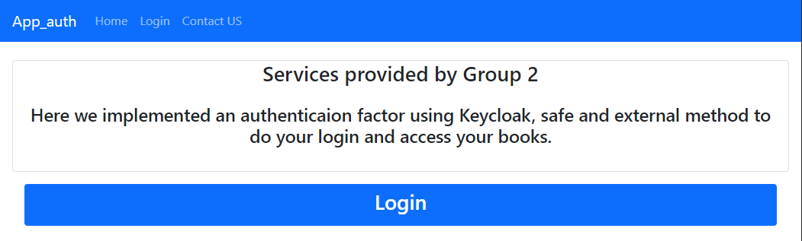
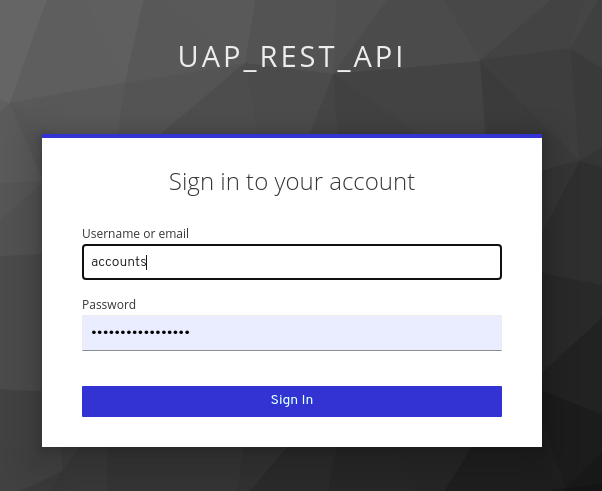

# SIO - Project 2 - Authentication - APP_AUTH

-----

## Instructions to run the project

To run the Web Application, the following steps are needed:

1. First open app_auth present in project-2---authentication-equipa_2, the current path sould be ```project-2---authentication-equipa_2/app_auth```
2. Run the following commands on the command line:
3. ``` npm install ```
4. ``` ng serve --open --port 4200```


The web page should open as shown on the image:


## Instructions to login

In order to login follow the following steps:

1. At the home page select ```Login```
2. When prompted with the login form enter the following credentials:
3. Username: ```accounts```
4. Password: ```Sh4r1ng_1s_C4r1ng```



After the login is successful, the user is now logged in and should see the following page:


